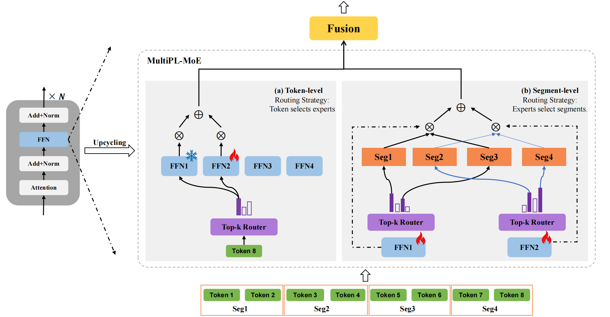

MultiPL-MoE
===========================
This repository contains the code for our EMNLP 2025 Paper: [MultiPL-MoE: Multi-Programming-Lingual Extension of Large Language Models through Hybrid Mixture-of-Experts](https://arxiv.org/abs/2508.19268).  <!-- 修改链接 -->

## Overview
We propose MultiPL-MoE, two paired MoEs to optimize expert selection at both the token and segment levels. The token-level MoE is a conventional token-choice routing combined with a shared expert with a novel routing weight normalization method to address scale mismatch during the later fusion with the segment-level MoE. For the segment-level MoE, we adopt the expert-choice routing mechanism with the input as contextually coherent segments, enabling experts to capture the syntax structures and discourse-level features. The outputs of the two MoEs are finally fused together. 

### Token-level MoE
The token-level MoE includes a shared expert in each layer to capture common knowledge and reduce redundancy in routed experts. The parameters of the shared expert are fixed during training. The routing strategy is traditional token-choice routing, in which the token selects experts.

### Segment-level MoE
Given that experts tend to be underspecialized with token-choice routing, we hypothesize that such pitfalls may be more severe in learning the segment structures of the programming languages. Therefore, the segment-level MoE adopts the expert-choice routing strategy that independently selects top-K segments for each expert. 

## Train MultiPL-MoE
In the following section, we provide instructions on training MultiPL-MoE with our code.

### Requirements
Create a new conda environment through 'environmental.yaml'

<pre>
conda env create -n nju-megatron -f environmental.yaml
</pre>

### Post-pretraining
`MultiPL-MoE/scripts/cm_sparse.sh` comes loaded with all relevant details to set hyperparameters and start training.

<pre>
bash MultiPL-MoE/scripts/cm_sparse.sh
</pre>

## Citation
If you find this work useful, please consider citing:
<pre>
@article{wang2025multipl,
  title={MultiPL-MoE: Multi-Programming-Lingual Extension of Large Language Models through Hybrid Mixture-of-Experts},
  author={Wang, Qing and Han, Xue and Wang, Jiahui and Xing, Lehao and Hu, Qian and Zhang, Lianlian and Deng, Chao and Feng, Junlan},
  journal={arXiv preprint arXiv:2508.19268},
  year={2025}
}
</pre>
